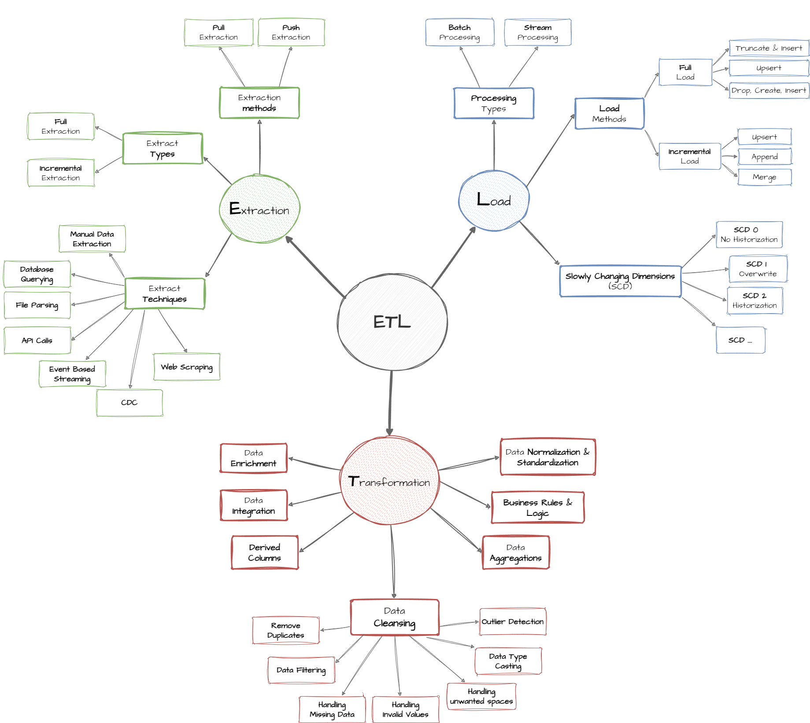
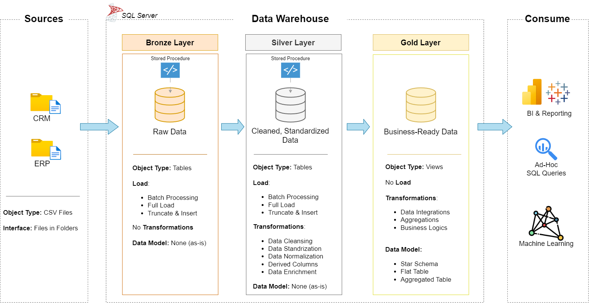
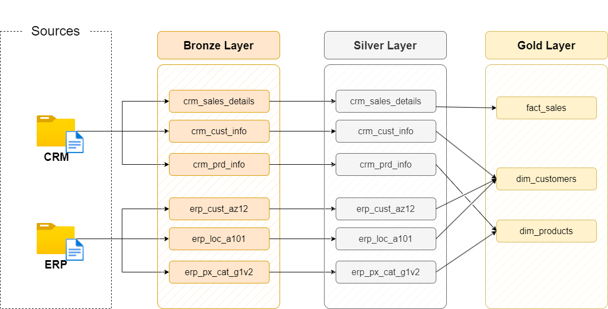
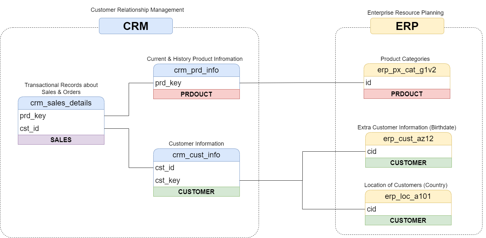
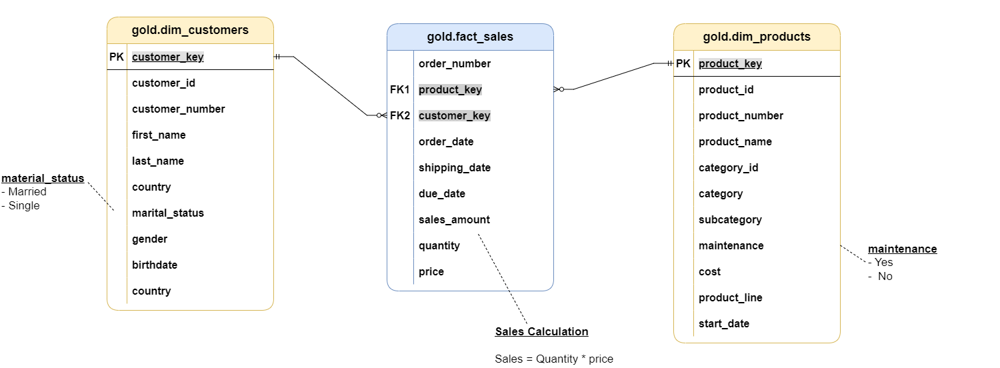

# Modern Data Warehouse  

This project demonstrates how I designed and implemented a **modern data warehouse** to transform raw business data into meaningful insights for decision-making. It highlights my skills in **data engineering, data modeling, and analytics** by building a structured pipeline from ingestion to reporting.  

---

## Architecture & Workflow

### ETL Process


### Data Architecture


### Data Flow


### Data Integration


### Data Model


---

## Data Architecture  

I built the warehouse using the **Medallion Architecture** with three layers:  

1. **Bronze Layer** – Ingested raw data from ERP and CRM systems (CSV files) into SQL Server.  
2. **Silver Layer** – Applied data cleaning, standardization, and transformation to ensure consistency and quality.  
3. **Gold Layer** – Modeled business-ready data in a **star schema** for efficient analysis and reporting.  

This layered approach made the warehouse scalable, maintainable, and easy to query for insights.  

---

## Key Contributions  

- **Designed the warehouse architecture** using SQL Server and implemented data pipelines to move data through Bronze, Silver, and Gold layers.  
- **Developed ETL pipelines** to extract data from source systems, transform it for consistency, and load it into the warehouse.  
- **Built fact and dimension tables** to support star-schema modeling and optimized analytical queries.  
- **Created SQL-based reports and dashboards** to track customer behavior, product performance, and sales trends.  
- **Documented the process** (data models, naming conventions, and data flow diagrams) for both technical and non-technical stakeholders.  

---

## Tools & Technologies Used  

- **SQL Server Express** and **SSMS** for database design, management, and queries  
- **DrawIO** for data architecture and modeling diagrams  
- **Notion** for project planning and documentation  
- **GitHub** for version control and collaboration  
- **CSV datasets (ERP & CRM systems)** as source data  

---

### Analytics and Reporting (Data Analysis)

**Objective**  
Develop SQL-based analytics to provide insights into:  
- Customer behavior  
- Product performance  
- Sales trends  

These reports and dashboards enable stakeholders to track key business metrics and support strategic decisions.  

For more details, see [docs/requirements.md](docs/requirements.md).  

---

## Repository Structure
```
data-warehouse-project/
│
├── datasets/                           # Input datasets (ERP and CRM)
│
├── docs/                               # Documentation and diagrams
│   ├── etl.drawio                      # ETL processes
│   ├── data_architecture.drawio        # System architecture
│   ├── data_catalog.md                 # Dataset descriptions and metadata
│   ├── data_flow.drawio                # Data flow diagram
│   ├── data_models.drawio              # Star schema model
│   ├── naming-conventions.md           # Guidelines for naming tables, columns, and files
│
├── scripts/                            # SQL ETL scripts
│   ├── bronze/                         # Raw data load scripts
│   ├── silver/                         # Data cleaning and transformations
│   ├── gold/                           # Final analytical models
│
├── tests/                              # Testing and data quality scripts
│
├── README.md                           # Main documentation
├── LICENSE                             # License information
├── .gitignore                          # Git ignore rules
└── requirements.txt                    # Project dependencies
```

---

## License

This project is licensed under the [MIT License](LICENSE). You are free to use, modify, and share it with proper attribution.
